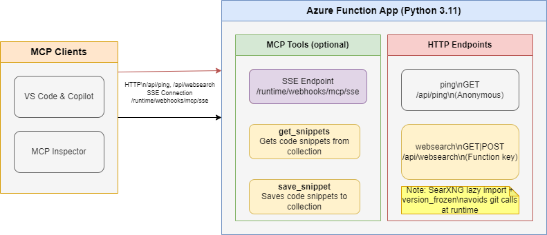

<!--
---
name: Remote MCP with Azure Functions (Python)
description: Run a remote MCP server on Azure functions.  
page_type: sample
languages:
- python
- bicep
- azdeveloper
products:
- azure-functions
- azure
urlFragment: remote-mcp-functions-python
---
-->

# Azure Functions Python – MCP Tools and Web Search

This project contains a Python Azure Functions app that exposes:

- An anonymous health endpoint `GET /api/ping`
- A function-key protected web search endpoint `GET|POST /api/websearch` backed by SearXNG
- Optional MCP tool triggers (e.g., `hello_mcp`, `get_snippet`, `save_snippet`) when enabled

The app uses the new Python v2 decorators model. Do not mix with legacy `function.json` based functions.

Architecture (high level):



## Prerequisites

+ [Python](https://www.python.org/downloads/) version 3.11 or higher
+ [Azure Functions Core Tools](https://learn.microsoft.com/azure/azure-functions/functions-run-local?pivots=programming-language-python#install-the-azure-functions-core-tools) >= `4.0.7030`
+ [Azure Developer CLI](https://aka.ms/azd)
+ To use Visual Studio Code to run and debug locally:
  + [Visual Studio Code](https://code.visualstudio.com/)
  + [Azure Functions extension](https://marketplace.visualstudio.com/items?itemName=ms-azuretools.vscode-azurefunctions)

## Prepare your local environment

An Azure Storage Emulator is needed for this particular sample because we will save and get snippets from blob storage.

1. Start Azurite

    ```shell
    docker run -p 10000:10000 -p 10001:10001 -p 10002:10002 \
        mcr.microsoft.com/azure-storage/azurite
    ```

>**Note** if you use Azurite coming from VS Code extension you need to run `Azurite: Start` now or you will see errors.

## Run your MCP Server locally from the terminal

1. Change to the src folder in a new terminal window:

   ```shell
   cd src
   ```

1. Install Python dependencies:

   ```shell
   pip install -r requirements.txt
   ```

>**Note** it is a best practice to create a Virtual Environment before doing the `pip install` to avoid dependency issues/collisions, or if you are running in CodeSpaces.  See [Python Environments in VS Code](https://code.visualstudio.com/docs/python/environments#_creating-environments) for more information.

1. Start the Functions host locally:

   ```shell
   func start
   ```

> **Note** by default this will use the webhooks route: `/runtime/webhooks/mcp/sse`.  Later we will use this in Azure to set the key on client/host calls: `/runtime/webhooks/mcp/sse?code=<system_key>`

## HTTP endpoints in this repository

This project exposes two simple HTTP endpoints alongside the optional MCP triggers.

- Health check (no auth): `GET /api/ping`
- Web search (function auth): `GET|POST /api/websearch`

Examples (replace <app> and <FUNCTION_OR_HOST_KEY>):

```bash
# Health check
curl -s "https://<app>.azurewebsites.net/api/ping"

# Web search - GET (requires function or host key)
curl -s "https://<app>.azurewebsites.net/api/websearch?query=azure&code=<FUNCTION_OR_HOST_KEY>"

# Web search - POST (requires function or host key)
curl -s -X POST "https://<app>.azurewebsites.net/api/websearch?code=<FUNCTION_OR_HOST_KEY>" \
  -H "Content-Type: application/json" \
  -d '{ "query": "Say this is a test", "max_results": 3 }'
```

Retrieve a key via CLI:

```bash
az functionapp keys list \
  -g <resource_group> \
  -n <app>
```

Notes:
- The `websearch` endpoint expects a `query` field. Do not send OpenAI-style payloads like `{ "prompt": ... }`.
- `ping` is anonymous; `websearch` uses `FUNCTION` auth by default.
- Responses from `/api/websearch` include an `unresponsive_engines` array with
  engine names and error types for any engines that failed to respond.

## Connect to the *local* MCP server from a client/host (optional)

### VS Code - Copilot agent mode

1. **Add MCP Server** from command palette and add URL to your running Function app's SSE endpoint:

    ```shell
    http://localhost:7071/runtime/webhooks/mcp/sse
    ```

1. **List MCP Servers** from command palette and start the server
1. In Copilot chat agent mode enter a prompt to trigger the tool, e.g., select some code and enter this prompt

    ```plaintext
    Say Hello
    ```

    ```plaintext
    Save this snippet as snippet1 
    ```

    ```plaintext
    Retrieve snippet1 and apply to newFile.py
    ```

1. When prompted to run the tool, consent by clicking **Continue**

1. When you're done, press Ctrl+C in the terminal window to stop the Functions host process.

### MCP Inspector

1. In a **new terminal window**, install and run MCP Inspector

    ```shell
    npx @modelcontextprotocol/inspector
    ```

2. CTRL click to load the MCP Inspector web app from the URL displayed by the app (e.g. http://0.0.0.0:5173/#resources)
3. Set the transport type to `SSE`
4. Set the URL to your running Function app's SSE endpoint and **Connect**:

    ```shell
    http://localhost:7071/runtime/webhooks/mcp/sse
    ```

>**Note** this step will not work in CodeSpaces.  Please move on to Deploy to Remote MCP.  

5. **List Tools**.  Click on a tool and **Run Tool**.

## Verify local blob storage in Azurite

After testing the snippet save functionality locally, you can verify that blobs are being stored correctly in your local Azurite storage emulator.

### Using Azure Storage Explorer

1. Open Azure Storage Explorer
1. In the left panel, expand **Emulator & Attached** → **Storage Accounts** → **(Emulator - Default Ports) (Key)**
1. Navigate to **Blob Containers** → **snippets**
1. You should see any saved snippets as blob files in this container
1. Double-click on any blob to view its contents and verify the snippet data was saved correctly

### Using Azure CLI (Alternative)

If you prefer using the command line, you can also verify blobs using Azure CLI with the storage emulator:

```shell
# List blobs in the snippets container
az storage blob list --container-name snippets --connection-string "DefaultEndpointsProtocol=http;AccountName=devstoreaccount1;AccountKey=Eby8vdM02xNOcqFlqUwJPLlmEtlCDXJ1OUzFT50uSRZ6IFsuFq2UVErCz4I6tq/K1SZFPTOtr/KBHBeksoGMGw==;BlobEndpoint=http://127.0.0.1:10000/devstoreaccount1;"
```

```shell
# Download a specific blob to view its contents
az storage blob download --container-name snippets --name <blob-name> --file <local-file-path> --connection-string "DefaultEndpointsProtocol=http;AccountName=devstoreaccount1;AccountKey=Eby8vdM02xNOcqFlqUwJPLlmEtlCDXJ1OUzFT50uSRZ6IFsuFq2UVErCz4I6tq/K1SZFPTOtr/KBHBeksoGMGw==;BlobEndpoint=http://127.0.0.1:10000/devstoreaccount1;"
```

This verification step ensures your MCP server is correctly interacting with the local storage emulator and that the blob storage functionality is working as expected before deploying to Azure.

## Deploy to Azure

Initialize the template and then provision + deploy using [azd](https://aka.ms/azd):

```shell
azd init -t remote-mcp-functions-python
```

```shell
azd up
```

You can opt-in to a VNet being used in the sample. To do so, do this before `azd up`

```bash
azd env set VNET_ENABLED true
```

Additionally, you can front this app with API Management for policies and auth, and/or use App Service built-in authentication.

> Note on MCP SSE webhook support
>
> This project enables the MCP SSE webhook (`/runtime/webhooks/mcp/sse`) via the Experimental Extension Bundle in `host.json`.
> - Local: `ENABLE_MCP_TRIGGERS=true` is set in `local.settings.json`.
> - Azure: set an app setting `ENABLE_MCP_TRIGGERS=true` if you need the MCP triggers active in production. If you only need HTTP endpoints (`/api/ping`, `/api/websearch`), you can set it to `false`.

## Connect to your *remote* MCP server from a client (optional)

Your client will need a key in order to invoke the new hosted SSE endpoint, which will be of the form `https://<funcappname>.azurewebsites.net/runtime/webhooks/mcp/sse`. The hosted function requires a system key by default which can be obtained from the [portal](https://learn.microsoft.com/azure/azure-functions/function-keys-how-to?tabs=azure-portal) or the CLI (`az functionapp keys list --resource-group <resource_group> --name <function_app_name>`). Obtain the system key named `mcp_extension`.

### Connect to remote MCP server in MCP Inspector
For MCP Inspector, you can include the key in the URL: 
```plaintext
https://<funcappname>.azurewebsites.net/runtime/webhooks/mcp/sse?code=<your-mcp-extension-system-key>
```

### Connect to remote MCP server in VS Code - GitHub Copilot
For GitHub Copilot within VS Code, you should instead set the key as the `x-functions-key` header in `mcp.json`, and you would just use `https://<funcappname>.azurewebsites.net/runtime/webhooks/mcp/sse` for the URL. The following example uses an input and will prompt you to provide the key when you start the server from VS Code.  Note [mcp.json](.vscode/mcp.json) has already been included in this repo and will be picked up by VS Code.  Click Start on the server to be prompted for values including `functionapp-name` (in your /.azure/*/.env file) and `functions-mcp-extension-system-key` which can be obtained from CLI command above or API Keys in the portal for the Function App.  

```json
{
    "inputs": [
        {
            "type": "promptString",
            "id": "functions-mcp-extension-system-key",
            "description": "Azure Functions MCP Extension System Key",
            "password": true
        },
        {
            "type": "promptString",
            "id": "functionapp-name",
            "description": "Azure Functions App Name"
        }
    ],
    "servers": {
        "remote-mcp-function": {
            "type": "sse",
            "url": "https://${input:functionapp-name}.azurewebsites.net/runtime/webhooks/mcp/sse",
            "headers": {
                "x-functions-key": "${input:functions-mcp-extension-system-key}"
            }
        },
        "local-mcp-function": {
            "type": "sse",
            "url": "http://localhost:7071/runtime/webhooks/mcp/sse"
        }
    }
}
```

For MCP Inspector, you can include the key in the URL: `https://<funcappname>.azurewebsites.net/runtime/webhooks/mcp/sse?code=<your-mcp-extension-system-key>`.

For GitHub Copilot within VS Code, you should instead set the key as the `x-functions-key` header in `mcp.json`, and you would just use `https://<funcappname>.azurewebsites.net/runtime/webhooks/mcp/sse` for the URL. The following example uses an input and will prompt you to provide the key when you start the server from VS Code:

```json
{
    "inputs": [
        {
            "type": "promptString",
            "id": "functions-mcp-extension-system-key",
            "description": "Azure Functions MCP Extension System Key",
            "password": true
        }
    ],
    "servers": {
        "my-mcp-server": {
            "type": "sse",
            "url": "<funcappname>.azurewebsites.net/runtime/webhooks/mcp/sse",
            "headers": {
                "x-functions-key": "${input:functions-mcp-extension-system-key}"
            }
        }
    }
}
```

### MCP client configurations included in this repo

This repository already contains ready-to-use client configurations for MCP:

- VS Code: `.vscode/mcp.json`
  - Start the MCP server from VS Code and select `remote-mcp-function`.
  - You will be prompted for `functionapp-name` and the `x-functions-key`.
  - Retrieve the key (system key named `mcp_extension`) with:
    ```bash
    az functionapp keys list -g <resource_group> -n <function_app_name>
    ```
  - For local testing, select `local-mcp-function` which points to `http://localhost:7071/runtime/webhooks/mcp/sse`.

- Claude Desktop: `claude_desktop.mcp.example.json`
  - Copy this file’s `mcpServers` section into your Claude Desktop MCP configuration.
  - Replace placeholders `<functionapp-name>` and `<your-mcp-extension-system-key>`.
  - Ensure the URL points to your Function App SSE endpoint and include the `x-functions-key` header.

## Redeploy your code

You can run the `azd up` command as many times as you need to both provision your Azure resources and deploy code updates to your function app.

>[!NOTE]
>Deployed code files are always overwritten by the latest deployment package.

## Configuration and operational notes

- New Python v2 decorators only. Do not include any `function.json` files.
- To enable MCP triggers in Azure, set `ENABLE_MCP_TRIGGERS=true` (default is `false`).
- Keep `host.json` on the stable bundle:

  ```json
  {
    "extensionBundle": {
      "id": "Microsoft.Azure.Functions.ExtensionBundle",
      "version": "[4.*, 5.0.0)"
    }
  }
  ```

- On Flexible Consumption, do not set `FUNCTIONS_WORKER_RUNTIME` manually.
- If deployed functions “disappear” after a deploy, suspect a module-level import error. In this project, SearXNG imports are lazy to avoid this. We also include `searx/version_frozen.py` to avoid calling `git` at runtime.

### Copilot Studio integration

- Create a custom action that calls your Function App’s `POST https://<app>.azurewebsites.net/api/mcp-run`.
- Provide the `prompt` from the user’s utterance/inputs. If your Function App enforces function keys, pass `mcp_key` and point `mcp_url` to:
    `https://<app>.azurewebsites.net/runtime/webhooks/mcp/sse`.
- Restrict `allowed_tools` to only what you expect the model to run (e.g., `hello_mcp`, `save_snippet`, `get_snippet`).

## Clean up resources

When you're done working with your function app and related resources, you can use this command to delete the function app and its related resources from Azure and avoid incurring any further costs:

```shell
azd down
```

## Helpful Azure Commands

Once your application is deployed, you can use these commands to manage and monitor your application:

```bash
# Get your function app name from the environment file
FUNCTION_APP_NAME=$(cat .azure/$(cat .azure/config.json | jq -r '.defaultEnvironment')/env.json | jq -r '.FUNCTION_APP_NAME')
echo $FUNCTION_APP_NAME

# Get resource group 
RESOURCE_GROUP=$(cat .azure/$(cat .azure/config.json | jq -r '.defaultEnvironment')/env.json | jq -r '.AZURE_RESOURCE_GROUP')
echo $RESOURCE_GROUP

# View function app logs
az webapp log tail --name $FUNCTION_APP_NAME --resource-group $RESOURCE_GROUP

# Redeploy the application without provisioning new resources
azd deploy
```

## HTTP endpoints in this repository

This project exposes two simple HTTP endpoints alongside the MCP triggers.

- Health check (no auth): `GET /api/ping`
- Web search (function auth): `GET|POST /api/websearch`

Examples (replace <app> and <FUNCTION_OR_HOST_KEY>):

```bash
# Health check
curl -s "https://<app>.azurewebsites.net/api/ping"

# Web search - GET (requires function or host key)
curl -s "https://<app>.azurewebsites.net/api/websearch?query=azure&code=<FUNCTION_OR_HOST_KEY>"

# Web search - POST (requires function or host key)
curl -s -X POST "https://<app>.azurewebsites.net/api/websearch?code=<FUNCTION_OR_HOST_KEY>" \
  -H "Content-Type: application/json" \
  -d '{ "query": "Say this is a test", "max_results": 3 }'
```

Retrieve a key via CLI:

```bash
az functionapp keys list \
  -g <resource_group> \
  -n <app>
```

Notes:
- The `websearch` endpoint expects a `query` field. Do not send OpenAI-style payloads like `{ "prompt": ... }`.
- `ping` is anonymous; `websearch` uses `FUNCTION` auth by default.
- Responses from `/api/websearch` include an `unresponsive_engines` array with
  engine names and error types for any engines that failed to respond.

## Source Code (snippets)

In the monorepo, two apps are prepared:

- `src/` (Model Orchestrator): HTTP `mcp-run`, async enqueue/result/process, queue trigger, orchestration LLM.
- `tools_app/` (Tools MCP): expose MCP tools (`hello_mcp`, `get_snippet`, `save_snippet`).

During local dev you can run them independently with `func start` from each folder. In production, deploy them as two Function Apps and set in the orchestrator:

- `TOOLS_SSE_URL`: URL of the tools app SSE endpoint
- `TOOLS_FUNCTIONS_KEY`: Functions key for server-to-server auth

Here's the actual code from the function_app.py file in `src/`:

```python

@app.generic_trigger(arg_name="context", type="mcpToolTrigger", toolName="hello", 
                     description="Hello world.", 
                     toolProperties="[]")
def hello_mcp(context) -> None:
    """
    A simple function that returns a greeting message.

    Args:
        context: The trigger context (not used in this function).

    Returns:
        str: A greeting message.
    """
    return "Hello I am MCPTool!"


@app.generic_trigger(
    arg_name="context",
    type="mcpToolTrigger",
    toolName="getsnippet",
    description="Retrieve a snippet by name.",
    toolProperties=tool_properties_get_snippets_json
)
@app.generic_input_binding(
    arg_name="file",
    type="blob",
    connection="AzureWebJobsStorage",
    path=_BLOB_PATH
)
def get_snippet(file: func.InputStream, context) -> str:
    """
    Retrieves a snippet by name from Azure Blob Storage.
 
    Args:
        file (func.InputStream): The input binding to read the snippet from Azure Blob Storage.
        context: The trigger context containing the input arguments.
 
    Returns:
        str: The content of the snippet or an error message.
    """
    snippet_content = file.read().decode("utf-8")
    logging.info(f"Retrieved snippet: {snippet_content}")
    return snippet_content


@app.generic_trigger(
    arg_name="context",
    type="mcpToolTrigger",
    toolName="savesnippet",
    description="Save a snippet with a name.",
    toolProperties=tool_properties_save_snippets_json
)                   
@app.generic_output_binding(
    arg_name="file",
    type="blob",
    connection="AzureWebJobsStorage",
    path=_BLOB_PATH
)
def save_snippet(file: func.Out[str], context) -> str:
    content = json.loads(context)
    snippet_name_from_args = content["arguments"][_SNIPPET_NAME_PROPERTY_NAME]
    snippet_content_from_args = content["arguments"][_SNIPPET_PROPERTY_NAME]

    if not snippet_name_from_args:
        return "No snippet name provided"

    if not snippet_content_from_args:
        return "No snippet content provided"
 
    file.set(snippet_content_from_args)
    logging.info(f"Saved snippet: {snippet_content_from_args}")
    return f"Snippet '{snippet_content_from_args}' saved successfully"
```

The full source includes HTTP routes `ping` and `websearch`, plus optional MCP triggers guarded by `ENABLE_MCP_TRIGGERS`.

## Next Steps

- Add [API Management](https://aka.ms/mcp-remote-apim-auth) to your MCP server (auth, gateway, policies, more!)
- Add [built-in auth](https://learn.microsoft.com/en-us/azure/app-service/overview-authentication-authorization) to your MCP server
- Enable VNET using VNET_ENABLED=true flag
- Learn more about [related MCP efforts from Microsoft](https://github.com/microsoft/mcp/tree/main/Resources)
